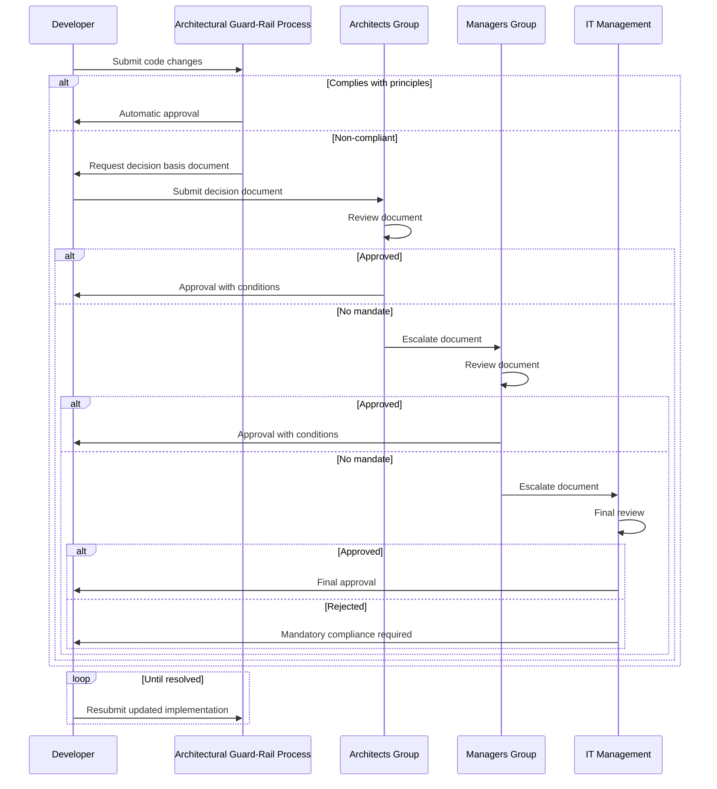
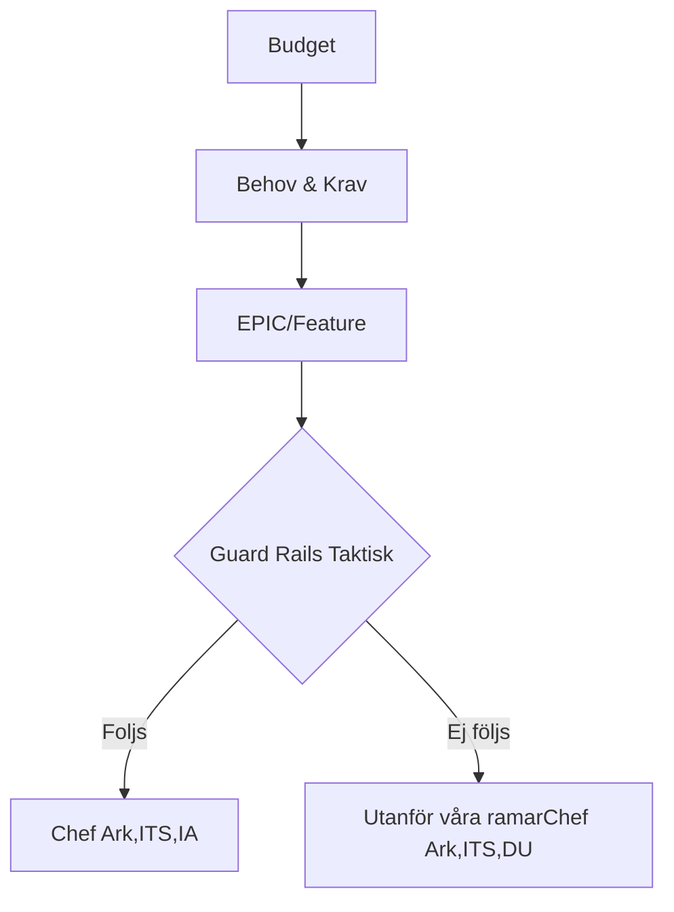
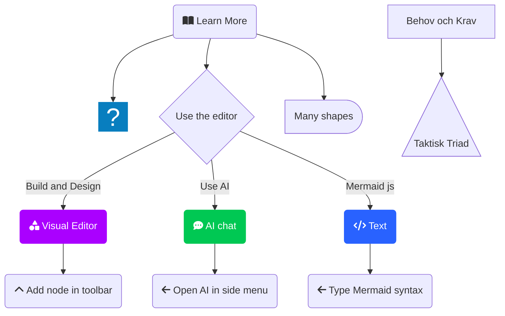

# Guard Rails for Taktisk Arkitekturstyrning

## Process Flow (When Guard Rails Are Not Followed)








## Key Differences from Azure DevOps Version:
1. **Mermaid Block Syntax**: Changed from ``````` to standard GitHub-supported ``````` code block[3][5]
2. **Compatibility**: Works natively in GitHub repositories, Gists, and GitHub Wiki[3][6]
3. **Rendering**: No additional extensions required for GitHub web interface[3]

## Guard Rails Components
- **Included**:
  - Arkitekturella principer
  - IT-relaterade riktlinjer
  - Etablerade IT-tjänster
  - Målarkitektur för domän[1]

- **Excluded**:
  - Utvecklingsverktygsval
  - Programmeringsspråksval
  - Komponentbiblioteksval
  - Designmönster-val[1]

## Implementation Requirements
| Aspect              | Specification                          |
|---------------------|----------------------------------------|
| Decision Document   | 2 alternative solutions required       |
| Documentation       | Arkitektforum beslutslogg              |
| Template Compliance | Must follow Arkitektforum format[1]    |

## Architectural Principles
1. Återanvänd befintliga lösningar
2. Löst kopplade system  
3. Ägande av data/tjänst
4. Integrerad säkerhet
5. Tillgänglighetsoptimering[1]

```

**Verification**: This format:
1. Uses GitHub's native Mermaid support[3][6]
2. Maintains Swedish terminology from original PPT[1]
3. Requires no external dependencies
4. Renders correctly in:
   - GitHub repository views
   - GitHub Wiki
   - GitHub Pages (with standard configuration)[6]

For GitHub Pages deployment, ensure your `_config.yml` includes:
```yaml
markdown: kramdown
plugins:
  - jekyll-mermaid
```
